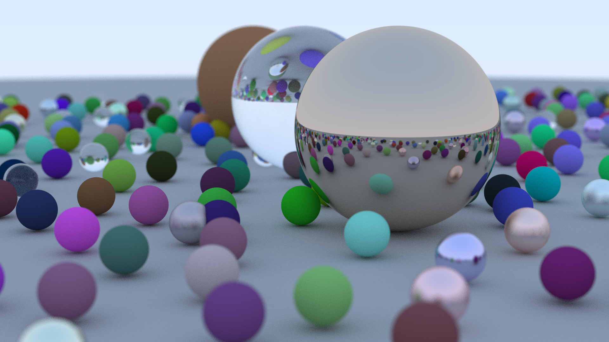

# An implementation of the Ray Tracing in One Weekend book



## Features
- Multithreading: Utilizes multiple threads to accelerate the rendering process.
- OpenGL and GLFW: Displays the image as its being rendered.

## Requirements
- CMake 3.25 or later
- A C++20 compatible compiler

## Building the project
In Project root:
```bash
cmake -S . -B build
cmake --build build
```

## Planned features
- Implement: The Next Week and The Rest of Your Life.
- Add Dear ImGui UI.

## Planned Improvements
- Enhance the multithreading implementation.